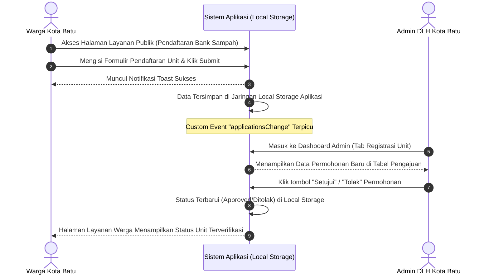

# MANUAL BOOK
## Sistem Informasi & Pengelolaan Bank Sampah DLH Kota Batu

**Oleh:**
* Javier Raihan - 202310370311308
* Fesal Farendika - 202310370311337
* Nifail Eka Nafie - 202310370311344

---

## Daftar Isi
1. [Pendahuluan](#1-pendahuluan)
2. [Tujuan Sistem](#2-tujuan-sistem)
3. [Isi Layanan (In The Box)](#3-isi-layanan-in-the-box)
4. [Spesifikasi Teknis](#4-spesifikasi-teknis)
5. [Persyaratan Sistem](#5-persyaratan-sistem)
6. [Navigasi & Hak Akses Pengguna](#6-navigasi--hak-akses-pengguna)
7. [Panduan Penggunaan Fitur - Pengunjung & Warga](#7-panduan-penggunaan-fitur---pengunjung--warga)
    - 7.1 [Landing Page & Navigasi Global](#71-landing-page--navigasi-global)
    - 7.2 [Profil & Kontak DLH Batu](#72-profil--kontak-dlh-batu)
    - 7.3 [Layanan Publik (Pendaftaran Inline & Jadwal)](#73-layanan-publik-pendaftaran-inline--jadwal)
    - 7.4 [Data Pengelolaan Sampah (Dashboard Statistik)](#74-data-pengelolaan-sampah-dashboard-statistik)
    - 7.5 [Buku Tamu Digital & Pengunggahan Gambar](#75-buku-tamu-digital--pengunggahan-gambar)
    - 7.6 [Galeri Kegiatan Lingkungan & Artikel Detail](#76-galeri-kegiatan-lingkungan--artikel-detail)
    - 7.7 [Pusat Edukasi Pemilahan Sampah & FAQ Interaktif](#77-pusat-edukasi-pemilahan-sampah--faq-interaktif)
    - 7.8 [Direktori Bank Sampah (Waste Bank Directory)](#78-direktori-bank-sampah-waste-bank-directory)
8. [Panduan Penggunaan Fitur - Administrator DLH](#8-panduan-penggunaan-fitur---administrator-dlh)
    - 8.1 [Halaman Login & Masuk Konsol Admin](#81-halaman-login--masuk-konsol-admin)
    - 8.2 [Tab Registrasi Unit & Manajemen Permohonan Warga](#82-tab-registrasi-unit--manajemen-permohonan-warga)
    - 8.3 [Tab Jadwal Pickup & Pengeditan Data Logistik](#83-tab-jadwal-pickup--pengeditan-data-logistik)
    - 8.4 [Tab Aduan & Buku Tamu (Resolusi Multi-Status)](#84-tab-aduan--buku-tamu-resolusi-multi-status)
    - 8.5 [Tab Kelola Artikel Edukasi](#85-tab-kelola-artikel-edukasi)
9. [Alur Penggunaan Sistem](#9-alur-penggunaan-sistem)
10. [Frequently Asked Questions (FAQ)](#10-frequently-asked-questions-faq)
11. [Penutup](#11-penutup)

---

## 1. Pendahuluan
**Sistem Informasi & Pengelolaan Bank Sampah DLH Kota Batu** merupakan platform digital berbasis website (*Single Page Application*) yang dirancang dengan estetika modern bertema *dark mode* (kombinasi warna *Deep Navy* dan aksen *Emerald Green*). Platform ini berfungsi sebagai pusat informasi layanan publik Dinas Lingkungan Hidup Kota Batu, visualisasi data statistik pengelolaan sampah terintegrasi, sarana interaksi masyarakat lewat buku tamu, dokumentasi aktivitas lingkungan hidup, serta media edukasi pemilahan sampah digital bagi masyarakat umum, anak-anak, lansia, maupun pihak birokrat dinas.

---

## 2. Tujuan Sistem
Platform ini dikembangkan dengan tujuan utama:
1. **Transparansi Data**: Menyajikan data volume penumpukan, pengolahan, dan pendaurulangan sampah di Kota Batu secara interaktif dan visual bagi masyarakat luas.
2. **Kemudahan Layanan**: Mempermudah pendaftaran kelompok warga baru ke jaringan Bank Sampah secara digital dan instan.
3. **Edukasi Praktis**: Mengajarkan kebiasaan memilah sampah harian melalui modul edukasi interaktif yang ramah berbagai usia (*Audience Selector*).
4. **Respon Cepat Aduan**: Memungkinkan warga mengirimkan laporan tumpukan sampah liar dengan foto pendukung, yang dapat langsung ditanggapi dan diperbarui statusnya oleh Admin DLH.

---

## 3. Isi Layanan (In The Box)
Sistem ini terbagi menjadi 9 modul utama yang saling terintegrasi:

| No | Modul / Halaman | Deskripsi / Fungsi |
|---|---|---|
| 1 | **Landing Page** | Gerbang utama informasi, metrik cepat kota, dan highlight aktivitas terbaru. |
| 2 | **Profil DLH** | Informasi instansi, visi-misi, 3 pilar, serta jam operasional & lokasi kantor dinas. |
| 3 | **Layanan Publik** | Formulir pendaftaran unit baru (inline), permintaan edukasi, dan akses jadwal truk sampah. |
| 4 | **Data Pengelolaan** | Chart interaktif Recharts (Area & Pie) tren sampah skala kota. |
| 5 | **Buku Tamu** | Forum warga untuk masukan umum atau pengaduan sampah dengan unggahan foto. |
| 6 | **Galeri Kegiatan** | Kumpulan dokumentasi aksi sosial dan kampanye lingkungan hidup DLH Kota Batu. |
| 7 | **Edukasi & FAQ** | Panduan pemilahan sampah mandiri, download modul PDF, dan FAQ accordion. |
| 8 | **Admin Dashboard** | Konsol kendali validasi unit bank sampah, jadwal pickup, modul edit artikel, dan feedback status. |
| 9 | **Direktori Bank Sampah** | Peta interaktif, pencarian, dan profil detail seluruh bank sampah di Kota Batu. |

---

## 4. Spesifikasi Teknis
* **Arsitektur**: React.js (*Single Page Application*) dibangun di atas Vite.
* **Styling**: Vanilla CSS dikombinasikan dengan utility-first Tailwind CSS v3.
* **Routing**: React Router DOM v6 untuk navigasi mulus tanpa reload halaman.
* **Visualisasi**: Recharts (Responsive Area Chart & Pie Chart).
* **Set Ikon**: Lucide React.
* **Data State**: Sinkronisasi real-time state menggunakan `localStorage` terpusat dan *Custom Event Listener* agar data tersambung instan antar-halaman.

---

## 5. Persyaratan Sistem
Sebelum mengakses aplikasi ini, pastikan perangkat memenuhi kriteria:
* **Perangkat**: PC, Laptop, Tablet, atau Smartphone (Responsive Layout).
* **Browser**: Google Chrome (versi 100+), Mozilla Firefox (versi 100+), Safari, atau Microsoft Edge versi terbaru.
* **Koneksi**: Server berjalan lokal (Offline), tetapi memerlukan internet aktif untuk memuat font dari Google Fonts (Inter Font) dan gambar eksternal.

---

## 6. Navigasi & Hak Akses Pengguna

Sistem ini memiliki **tiga jenis peran pengguna** dengan hak akses yang berbeda:
1. **Pengunjung Umum (Guest/Belum Login)**: Dapat melihat data profil, membaca berita, melihat edukasi, dan mengisi buku tamu dasar (hanya memilih kategori visitor & menulis pesan, nama/email otomatis tersembunyi karena belum terdaftar).
2. **Masyarakat Terdaftar (Logged In)**: Dapat mengakses menu Layanan Publik, mendaftarkan kelompok Bank Sampah Baru secara inline, dan mengisi buku tamu dengan identitas lengkap secara otomatis.
3. **Administrator DLH (Admin)**: Memiliki kendali penuh untuk menyetujui pendaftaran Bank Sampah baru, mengedit & menambah jadwal logistik penjemputan truk sampah, mengubah status aduan warga, serta menulis artikel edukasi baru.

### Tabel Matriks Akses:
| Fitur / Modul | Pengunjung Umum | Warga Terdaftar | Admin DLH |
|---|:---:|:---:|:---:|
| Melihat Profil & Edukasi | ✓ | ✓ | ✓ |
| Mengisi Buku Tamu Dasar | ✓ | ✓ | ✓ |
| Mengisi Buku Tamu Lengkap + Gambar | ✗ | ✓ | ✓ |
| Pendaftaran Unit Bank Sampah | ✗ | ✓ | ✓ |
| Akses Dashboard Statistik | ✓ | ✓ | ✓ |
| Akses Direktori Bank Sampah | ✓ | ✓ | ✓ |
| Validasi Pendaftaran Baru | ✗ | ✗ | ✓ |
| Mengedit Jadwal Truk Sampah | ✗ | ✗ | ✓ |
| Mengubah Status Pengaduan Warga | ✗ | ✗ | ✓ |
| Publikasi & Edit Artikel Edukasi | ✗ | ✗ | ✓ |

---

## 7. Panduan Penggunaan Fitur - Pengunjung & Warga

### 7.1 Landing Page & Navigasi Global
Saat pertama kali membuka website DLHBatu, pengguna akan diarahkan ke Landing Page.

`[FOTO SCREENSHOT: HALAMAN LANDING PAGE UTAMA]`
*Placeholder: Capture hero section, stats block, dan navbar atas dengan Audience Mode.*

#### Langkah Navigasi:
1. **Navigasi Menu**: Gunakan menu pada navbar bagian atas (Profil DLH, Layanan Publik, Statistik, Buku Tamu, Aktivitas, Edukasi) untuk berpindah halaman secara instan.
2. **Audience Mode (Pilih Target Pengguna)**: Di bagian pojok kanan atas navbar, terdapat menu dropdown untuk merubah mode audience (Standar, Anak-anak, Lansia, Pemerintah).
3. **Tombol Login / Register**: Apabila Anda belum memiliki akun, klik tombol **"Mulai / Login & Register Akun"** di tengah banner halaman untuk mendaftarkan akun warga Anda.

---

### 7.2 Profil & Kontak DLH Batu
Halaman ini menyajikan profil instansi Dinas Lingkungan Hidup Kota Batu.

`[FOTO SCREENSHOT: HALAMAN PROFIL DLH KOTA BATU]`
*Placeholder: Capture banner profil dengan latar belakang Green City Kota Batu, 3 pilar, dan kontak.*

#### Langkah Penggunaan:
1. **Melihat Visi Misi Lengkap**: Gulir halaman ke bawah ke bagian *Vision & Pillars*. Klik tombol **"Lihat Visi & Misi Lengkap"** untuk membuka modal pop-up yang berisi detail target dinas.
2. **Membaca Detail Pilar**: Pada kartu *Pilar Utama*, klik **"Detail Pilar"** untuk membuka penjelasan detail mengenai target pengurangan sampah dan pemberdayaan ekonomi sirkuler.
3. **Membaca Alur Kerja**: Pada kartu penjelasan *Weigh & Record* dan *Economic Value*, klik **"Baca Detail"** untuk menampilkan alur operasional timbangan digital presisi serta rantai penjualan daur ulang.
4. **Kontak dan Lokasi**: Menampilkan informasi jam operasional, saluran kontak resmi, serta alamat instansi DLH Kota Batu.

---

### 7.3 Layanan Publik (Pendaftaran Inline & Jadwal)
Menu ini memfasilitasi kebutuhan layanan warga secara langsung tanpa perlu berpindah halaman.

`[FOTO SCREENSHOT: CATALOG LAYANAN PUBLIK & FORMULIR INLINE]`
*Placeholder: Capture grid layanan publik dan formulir pendaftaran unit baru yang muncul di bawah grid.*

#### A. Langkah Mendaftar Unit Bank Sampah Baru (Bagi Warga Terdaftar):
1. Masuk ke halaman **Layanan Publik**.
2. Klik tombol **"Akses Formulir"** pada kartu *Pendaftaran Bank Sampah*.
3. Formulir pendaftaran akan langsung muncul secara *inline* (di dalam bagian halaman tersebut).
4. Isi kolom formulir secara lengkap:
   - **Nama Unit Bank Sampah** (Contoh: Bank Sampah Melati Asri)
   - **Kecamatan**
   - **Kelurahan / Desa**
   - **Alamat Lengkap**
   - **Nama Ketua Pengurus**
   - **WhatsApp / No. Telp**
   - **Estimasi Jumlah Anggota (KK)**
5. Klik **"Kirim Permohonan"**.
6. Sistem akan menampilkan notifikasi toast hijau sukses di pojok kanan bawah, dan data permohonan Anda langsung masuk ke Dashboard Admin untuk dilakukan pemrosesan.
7. Jika ingin membatalkan pengisian, klik **"Kembali"** untuk menutup formulir secara instan dan mengembalikan tampilan katalog layanan semula.

#### B. Permintaan Layanan Edukasi & Sosialisasi:
1. Klik **"Akses Formulir"** pada kartu *Edukasi & Sosialisasi*.
2. Isi kolom formulir secara lengkap:
   - **Nama Sekolah / Instansi / Komunitas**
   - **Tanggal Rencana Pelaksanaan**
   - **Tema Sosialisasi** (Contoh: Pembuatan Kompos Organik)
   - **Nama Narahubung**
   - **WhatsApp Narahubung**
   - **Estimasi Jumlah Peserta (Orang)**
   - **Deskripsi Tambahan / Rincian Acara**
3. Klik **"Kirim Permohonan"**.
4. Sistem akan menampilkan toast pesan sukses. Klik **"Kembali"** jika ingin membatalkan formulir.

#### C. Penjemputan Sampah Terjadwal:
1. Klik **"Akses Jadwal"** pada kartu *Penjemputan Sampah Terjadwal*.
2. Sistem akan mengarahkan Anda secara otomatis langsung ke halaman **Collection Schedule (/schedule)** untuk melihat kalender pickup.

---

### 7.4 Data Pengelolaan Sampah (Dashboard Statistik)
Menampilkan grafik interaktif real-time volume pengelolaan sampah Kota Batu.

`[FOTO SCREENSHOT: GRAFIK DATA STATISTIK DATA SAMPAH]`
*Placeholder: Area Chart Recharts dan Pie Chart kategori sampah.*

#### Langkah Penggunaan:
1. Arahkan kursor Anda ke area grafik **Waste Collection Trends**. Tooltip interaktif akan muncul untuk menampilkan berat sampah yang terkumpul vs sampah yang didaur ulang pada bulan tertentu.
2. Pada grafik lingkaran **Waste Categories**, Anda dapat mengklik warna legenda untuk menyaring jenis sampah (Plastik, Kertas, Organik, atau Logam/Kaca).
3. Lihat daftar sebaran **Waste Bank Distribution** di bawah grafik untuk mengetahui daftar unit bank sampah teraktif saat ini.

---

### 7.5 Buku Tamu Digital & Pengunggahan Gambar
Wadah interaktif bagi masyarakat untuk memberi tanggapan atau mengadukan tumpukan sampah liar di lingkungan Kota Batu.

`[FOTO SCREENSHOT: HALAMAN BUKU TAMU DIGITAL & FORM INPUT]`
*Placeholder: Tampilan form buku tamu lengkap dengan tombol unggah gambar aduan.*

#### Langkah Mengisi Buku Tamu:
1. Buka menu **Buku Tamu**.
2. Jika Anda **belum login**: Isi *Kategori Pengunjung* dan masukkan pesan keluhan/saran Anda.
3. Jika Anda **telah login**: Nama Lengkap dan Email Anda otomatis terisi oleh sistem.
4. **Mengunggah Foto Aduan (Opsional)**: Klik tombol **"Pilih File / Drag & Drop Gambar"** jika Anda ingin mengunggah foto tumpukan sampah liar (format gambar JPEG/PNG).
5. Klik tombol **"Kirim Pesan Buku Tamu"**.
6. Pesan Anda akan langsung muncul di panel kanan **Recent Messages** secara real-time.

---

### 7.6 Galeri Kegiatan Lingkungan & Artikel Detail
Dokumentasi aktivitas sosial lingkungan hidup yang dijalankan oleh DLH Kota Batu.

`[FOTO SCREENSHOT: GALERI AKTIVITAS & MODAL DETAIL KEGIATAN]`
*Placeholder: Capture list grid kegiatan lingkungan dan pop-up detail berita.*

#### Langkah Penggunaan:
1. Buka menu **Galeri Kegiatan**.
2. Klik tombol **"Selengkapnya"** pada salah satu kartu artikel kegiatan.
3. Modal detail kegiatan akan muncul, menampilkan: foto ukuran penuh, deskripsi detail, kutipan resmi Kepala Dinas, dan pranala unduhan laporan.
4. Anda dapat membaca informasi dengan nyaman; modal ini dilengkapi dengan scroll bar internal apabila konten tulisan terlalu panjang.

---

### 7.7 Pusat Edukasi Pemilahan Sampah & FAQ Interaktif
Tempat belajar mandiri bagi warga untuk mengelola sampah harian di rumah.

`[FOTO SCREENSHOT: PORTAL EDUKASI & FAQ ACCORDION]`
*Placeholder: Grid tips pemilahan sampah, link download file PDF poster, dan FAQ accordion terbuka.*

#### Langkah Penggunaan:
1. **Membaca Tips Cepat**: Baca kartu tips singkat pada widget *Quick Tips* untuk memilah jenis sampah basah dan kering.
2. **Mengunduh Panduan Klasifikasi**: Klik ikon unduh pada kartu dokumen *Download Materials* untuk men-download poster resmi klasifikasi sampah dalam format PDF.
3. **Membaca FAQ Accordion**: Pada bagian bawah halaman, klik salah satu judul pertanyaan FAQ. Pertanyaan tersebut akan membuka panel jawaban secara interaktif dengan animasi slide terbuka yang mulus.

---

### 7.8 Direktori Bank Sampah (Waste Bank Directory)
Peta interaktif dan direktori lengkap untuk mencari bank sampah terdekat di Kota Batu.

`[FOTO SCREENSHOT: HALAMAN DIREKTORI BANK SAMPAH]`
*Placeholder: Tampilan peta interaktif, daftar bank sampah, dan panel detail.*

#### Langkah Penggunaan:
1. Buka menu navigasi yang mengarah ke **Direktori** (via link di Landing Page atau footer).
2. **Pencarian & Filter**: Gunakan kotak pencarian untuk mencari nama atau lokasi bank sampah. Anda juga dapat menekan tombol filter wilayah kecamatan (contoh: Batu, Bumiaji, Junrejo) untuk menyaring daftar bank sampah yang tampil.
3. **Melihat Detail**: Klik salah satu bank sampah pada daftar sebelah kiri (atau klik titik *pin* lokasi pada area peta) untuk melihat informasi lengkap di panel detail kanan, yang meliputi: jam operasional, alamat lengkap, nama manajer pengelola, dan jenis sampah yang diterima.

---

## 8. Panduan Penggunaan Fitur - Administrator DLH

### 8.1 Halaman Login & Masuk Konsol Admin
Akses kontrol khusus untuk petugas dinas mengelola aplikasi web.

`[FOTO SCREENSHOT: FORM LOGIN ADMIN]`
*Placeholder: Input username dan password admin.*

#### Langkah Masuk:
1. Klik menu **Login** di ujung kanan navbar.
2. Masukkan kredensial administrator resmi DLH Kota Batu.
3. Setelah login berhasil, navbar akan memunculkan menu baru bernama **Dashboard Admin**. Klik menu tersebut untuk masuk ke konsol kelola.

---

### 8.2 Tab Registrasi Unit & Manajemen Permohonan Warga
Mengelola permohonan pendaftaran kelompok Bank Sampah baru yang dikirimkan oleh warga dari halaman Layanan Publik.

`[FOTO SCREENSHOT: TAB REGISTRASI UNIT DI DASHBOARD ADMIN]`
*Placeholder: Tabel permohonan warga masuk dengan aksi Setujui / Tolak.*

#### Langkah Validasi:
1. Buka Tab **Registrasi Unit**.
2. Pada tabel **"Permohonan Masuk dari Warga"**, periksa nama unit, ketua pengurus, alamat, dan jumlah anggota yang mendaftar.
3. Klik tombol **"Setujui"** untuk mengesahkan unit tersebut (status berubah menjadi *Approved*).
4. Klik **"Tolak"** jika berkas tidak sesuai.
5. Klik **"Reset"** untuk mengembalikan status permohonan ke keadaan *Pending*.
6. Gunakan formulir **"Pendaftaran Unit Bank Sampah Baru"** di bagian bawah jika Anda ingin mendaftarkan unit baru secara manual dari kantor dinas secara langsung.

---

### 8.3 Tab Jadwal Pickup & Pengeditan Data Logistik
Mengatur rute penjemputan sampah organik dan anorganik oleh truk pengangkut sampah DLH Batu.

`[FOTO SCREENSHOT: TAB JADWAL PICKUP DENGAN TOMBOL EDIT INLINE]`
*Placeholder: Capture list jadwal pickup dengan tombol Edit berlogo pena.*

#### A. Langkah Mengubah/Mengedit Jadwal Penjemputan:
1. Klik Tab **Jadwal Pickup**.
2. Pilih jadwal penjemputan yang ingin dirubah pada daftar jadwal sebelah kiri. Klik tombol **"Edit (Ikon Pena)"**.
3. Form pengeditan inline akan langsung terbuka di dalam baris jadwal tersebut.
4. Ubah tanggal pickup, waktu jam operasional, kelurahan lokasi, atau kecamatan.
5. Klik **"Simpan"** untuk menyimpan perubahan, atau **"Batal"** untuk membatalkan pengeditan.

#### B. Langkah Menambahkan Jadwal Baru:
1. Isi formulir **"Tambah Jadwal Baru"** di kolom sebelah kanan.
2. Tentukan judul kegiatan, jenis sampah (organik/anorganik), kecamatan, kelurahan, tanggal, dan jam operasional.
3. Klik **"Terbitkan Jadwal"**. Jadwal baru otomatis tersimpan dan terpublikasi ke kalender warga.

---

### 8.4 Tab Aduan & Buku Tamu (Resolusi Multi-Status)
Mengelola status penanganan sampah liar atau aduan fasilitas TPS dari masyarakat.

`[FOTO SCREENSHOT: MANAJEMEN ADUAN WARGA & PESAN TERBARU SELESAI]`
*Placeholder: Tabel status aduan warga dan box pesan selesai beraksen hijau.*

#### Langkah Mengubah Status Aduan:
1. Klik Tab **Aduan & Buku Tamu**.
2. Pada tabel laporan, lihat keluhan warga beserta lampiran foto yang diunggah.
3. Klik tombol aksi status untuk merubah tahapan penanganan secara dua arah (bolak-balik):
   - Klik **"Proses"** jika keluhan berstatus *Baru* ingin segera ditindaklanjuti (status berubah menjadi *Diproses*).
   - Klik **"Selesaikan"** jika penanganan di lapangan telah rampung. Laporan akan otomatis berpindah ke kelompok **"Pesan & Pengaduan Terbaru (Selesai)"** di bawah tabel.
   - Klik **"Buka Ulang / Proses Kembali"** pada daftar laporan selesai jika sewaktu-waktu status perlu diubah kembali dari *Selesai* menjadi *Diproses* atau *Baru* (Reversible Status).
4. Klik **"Hapus (Ikon Sampah)"** untuk membersihkan aduan usang.

---

### 8.5 Tab Kelola Artikel Edukasi
Menulis dan menerbitkan panduan atau berita lingkungan hidup baru bagi warga.

`[FOTO SCREENSHOT: TAB KELOLA ARTIKEL EDUKASI ADMIN]`
*Placeholder: Form input penulisan artikel edukasi dan list artikel.*

#### Langkah Penggunaan:
1. Klik Tab **Artikel Edukasi**.
2. Untuk mempublikasikan artikel baru: Isi judul artikel, pilih kategori edukasi, lalu klik **"Terbitkan Artikel"**.
3. Untuk mengubah artikel yang sudah ada: Klik tombol **"Edit (Ikon Pena)"** pada artikel di daftar publikasi, lakukan perbaikan teks, lalu klik **"Simpan Perubahan"**.

---

## 9. Alur Penggunaan Sistem

Berikut diagram alur integrasi pendaftaran layanan dari Warga hingga divalidasi oleh Admin DLH:

---

## 10. Frequently Asked Questions (FAQ)

* **Q: Apakah saya harus mencuci plastik sebelum didaur ulang?**
  * **A**: Ya, sebaiknya plastik dibersihkan terlebih dahulu dari sisa makanan, minuman, atau kotoran lainnya. Plastik yang bersih lebih mudah diproses dan memiliki nilai daur ulang yang lebih baik.
* **Q: Sampah apa yang diterima pada Bank Sampah?**
  * **A**: Kami menerima kertas, plastik (PET, HDPE), kaleng, botol gelas, dan kardus (*cardboard*). Kami tidak menerima *styrofoam*, limbah pabrik radioaktif, maupun sampah rumah sakit. Cek detail di menu edukasi untuk melihat informasi lanjutan.
* **Q: Bagaimana cara saya mendapatkan uang dari sampah yang saya daur ulang?**
  * **A**: Anda dapat mengumpulkan dan memilah sampah yang dapat didaur ulang, kemudian menyetorkannya ke Bank Sampah. Sampah yang disetor akan ditimbang dan dinilai sesuai jenisnya. Hasil penjualan sampah akan dicatat sebagai saldo atau diberikan dalam bentuk uang sesuai ketentuan Bank Sampah.
* **Q: Apakah status pengaduan yang sudah ditandai "Selesai" oleh admin bisa dirubah kembali?**
  * **A**: Ya. Admin DLH dapat mengubah kembali status aduan yang selesai menjadi "Diproses" jika penanganan di lapangan memerlukan pengecekan ulang (*Reversible Status*).

---

## 11. Penutup
Manual Book ini disusun sebagai panduan operasional purwarupa (*frontend prototype*) **Sistem Informasi & Pengelolaan Bank Sampah DLH Kota Batu**. Seluruh fungsionalitas visual, animasi transisi, grafik interaktif, notifikasi toast sukses, serta layout responsif telah diimplementasikan secara matang demi mewujudkan sistem pelayanan publik digital yang profesional, *state-of-the-art*, dan berdaya guna bagi kemajuan lingkungan hidup di Kota Batu.

---
*Dinas Lingkungan Hidup Kota Batu - Menuju Kota Bersih & Lestari.*
